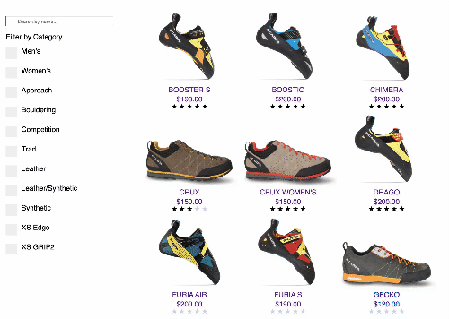
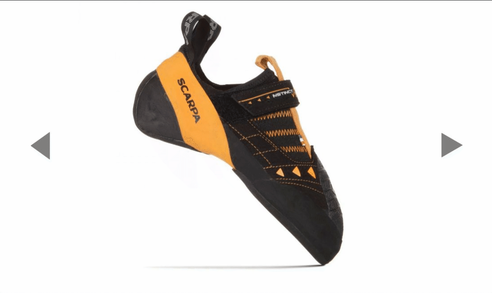
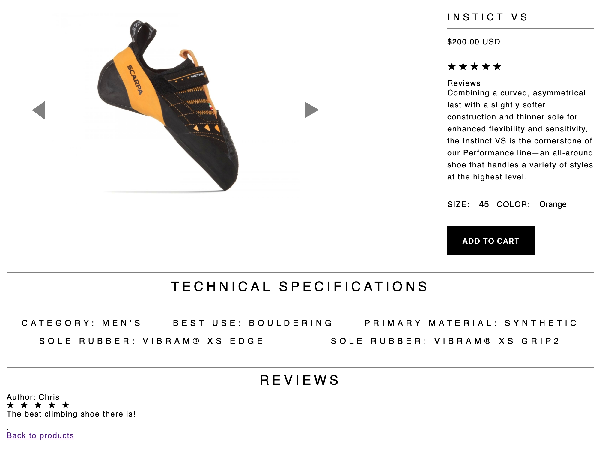

# [Scarpa](https://scrapa-climbing.herokuapp.com/#/)
Inspired by Scarpa Climbing Company.

## Background and Overview

Fullstack Clone with user-authentication using BCrypt, search and filter functionality, reviews section, and product ratings.

## Technologies

Backend: Ruby / Rails
Frontend: React / Redux
Amazon Web Service, PostgreSQL

## Primary Components
Cart functionality allows users to save products and return to them another time.

Lookup specific products by name, or filter products by attributes in the sidenav.

Custom photo carousel lets customers view shoe from different angles.

Each product page lists a detailed description of the product, size selection, listed attributes of each shoe, and a review section.

